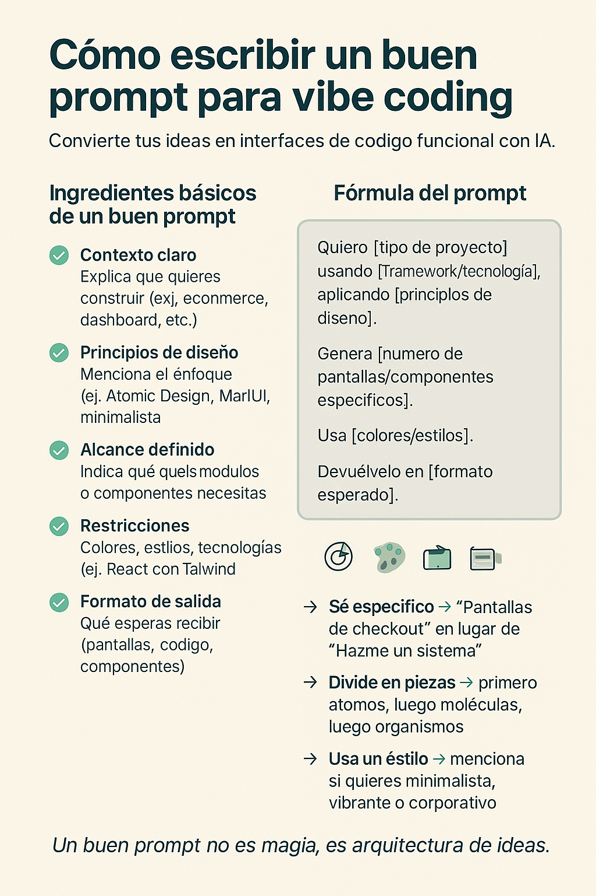

# 🎨 UX/UI: Diseño de Interfaces y Experiencia de Usuario

El diseño de interfaces y la experiencia de usuario (UX/UI) son aspectos cruciales en el desarrollo de aplicaciones web. Una buena interfaz no solo debe ser visualmente atractiva, sino también funcional y fácil de usar. Aquí te presento algunos conceptos clave y mejores prácticas para diseñar interfaces efectivas.

---

## 🎯 Principios Básicos de Diseño UI

### **1. 🔄 Consistencia**

Mantén un diseño coherente en toda la aplicación. Usa los mismos colores, tipografías y estilos de botones para que los usuarios se sientan familiarizados.

### **2. ✨ Simplicidad**

Evita el desorden. Un diseño limpio y minimalista ayuda a los usuarios a enfocarse en lo importante.

### **3. 📊 Jerarquía Visual**

Usa tamaños, colores y espacios para guiar la atención del usuario hacia los elementos más importantes.

### **4. ♿ Accesibilidad**

Asegúrate de que tu diseño sea accesible para todos los usuarios, incluyendo aquellos con discapacidades. Usa contrastes adecuados y proporciona alternativas textuales para imágenes.

### **5. 💬 Feedback del Usuario**

Proporciona retroalimentación inmediata a las acciones del usuario, como animaciones o mensajes de confirmación.

---

## 🚀 Mejores Prácticas de UX

### **1. 🔍 Investigación del Usuario**

Comprende las necesidades y comportamientos de tus usuarios mediante encuestas, entrevistas y pruebas de usabilidad.

### **2. 🎭 Prototipado**

Crea prototipos de baja fidelidad (wireframes) para planificar la estructura de tu aplicación antes de diseñar la interfaz completa.

### **3. 🧪 Pruebas de Usabilidad**

Realiza pruebas con usuarios reales para identificar problemas y áreas de mejora en tu diseño.

### **4. 🔄 Iteración Continua**

El diseño UX/UI es un proceso iterativo. Recoge feedback constantemente y mejora tu diseño con el tiempo.

### **5. 📱 Diseño Responsivo**

Asegúrate de que tu aplicación funcione bien en diferentes dispositivos y tamaños de pantalla.

---

## 🎓 Presentación UX/UI

### **📹 Presentación en Canva**

<div style="position: relative; width: 100%; height: 0; padding-top: 56.2500%; padding-bottom: 0; box-shadow: 0 2px 8px 0 rgba(63,69,81,0.16); margin-top: 1.6em; margin-bottom: 0.9em; overflow: hidden; border-radius: 8px; will-change: transform;">
  <iframe
    loading="lazy"
    style="position: absolute; width: 100%; height: 100%; top: 0; left: 0; border: none; padding: 0; margin: 0;"
    src="https://www.canva.com/design/DAGxx7-AYdE/a9oo8wmk2VHGVDWXtACuLQ/watch?embed"
    allowfullscreen="allowfullscreen"
    allow="fullscreen">
  </iframe>
</div>

**📚 Título:** [Diseño de Interfaces – Experiencia Inadaptada](https://www.canva.com/design/DAGxx7-AYdE/a9oo8wmk2VHGVDWXtACuLQ/watch?utm_content=DAGxx7-AYdE&utm_campaign=designshare&utm_medium=embeds&utm_source=link)
**Instructor:** Rodrigo Leaños

---

## 🛠️ Herramientas de Prototipado

### **💡 Vibe Coding para Prototipos**

Una excelente manera de generar ideas rápidas para prototipos es usar herramientas de IA con prompts efectivos:



> **💡 Tip:** Un buen prompt debe ser específico, claro y contener contexto sobre el tipo de interfaz que necesitas diseñar.

---

## 📚 Recursos Adicionales

### **🌐 Guías de Diseño Oficiales**

| 🏢 Compañía   | 📖 Recurso                 | 🔗 Link                                                                                      |
| ------------- | -------------------------- | -------------------------------------------------------------------------------------------- |
| **Google**    | Material Design            | [material.io/design](https://material.io/design)                                             |
| **Apple**     | Human Interface Guidelines | [developer.apple.com/design](https://developer.apple.com/design/human-interface-guidelines/) |
| **Microsoft** | Fluent Design System       | [fluent2.microsoft.design](https://fluent2.microsoft.design/)                                |

### **📰 Blogs y Artículos Especializados**

| 📰 Recurso               | 📋 Descripción                  | 🔗 Link                                                   |
| ------------------------ | ------------------------------- | --------------------------------------------------------- |
| **Nielsen Norman Group** | Artículos y recursos sobre UX   | [nngroup.com](https://www.nngroup.com/)                   |
| **A List Apart**         | Artículos sobre diseño web y UX | [alistapart.com](https://alistapart.com/)                 |
| **UX Planet**            | Comunidad y artículos de UX     | [uxplanet.org](https://uxplanet.org/)                     |
| **Smashing Magazine**    | Recursos de diseño y desarrollo | [smashingmagazine.com](https://www.smashingmagazine.com/) |

### **🎨 Herramientas de Diseño**

| 🛠️ Herramienta | 💰 Precio      | 🎯 Mejor para           |
| -------------- | -------------- | ----------------------- |
| **Figma**      | Gratis/Premium | Diseño colaborativo     |
| **Sketch**     | Premium        | Diseño para macOS       |
| **Adobe XD**   | Gratis/Premium | Prototipos interactivos |
| **Canva**      | Gratis/Premium | Diseños rápidos         |
| **Framer**     | Premium        | Prototipos avanzados    |

---

## 🎯 Checklist de UX/UI

### **✅ Antes de Diseñar**

- [ ] **Investigar** las necesidades del usuario
- [ ] **Definir** los objetivos del proyecto
- [ ] **Crear** user personas
- [ ] **Mapear** el user journey
- [ ] **Analizar** la competencia

### **✅ Durante el Diseño**

- [ ] **Crear** wireframes de baja fidelidad
- [ ] **Diseñar** mockups de alta fidelidad
- [ ] **Establecer** un sistema de design tokens
- [ ] **Asegurar** consistencia visual
- [ ] **Verificar** accesibilidad (contraste, alt text)

### **✅ Después del Diseño**

- [ ] **Realizar** pruebas de usabilidad
- [ ] **Recoger** feedback de usuarios
- [ ] **Iterar** basado en los resultados
- [ ] **Documentar** patrones y componentes
- [ ] **Mantener** el design system actualizado

---

## 📱 Principios de Diseño Responsivo

### **🔧 Breakpoints Recomendados**

```css
/* Mobile */
@media (max-width: 768px) {
}

/* Tablet */
@media (min-width: 769px) and (max-width: 1024px) {
}

/* Desktop */
@media (min-width: 1025px) {
}
```

### **📐 Grid Systems**

- **Mobile First**: Diseña primero para móviles
- **Flexible Grid**: Usa porcentajes en lugar de píxeles fijos
- **Touch Targets**: Mínimo 44px para elementos táctiles
- **Readable Text**: Mínimo 16px de tamaño de fuente

---

## 🎨 Color y Tipografía

### **🌈 Paletas de Color**

- **Primario**: Color principal de la marca
- **Secundario**: Color complementario
- **Neutros**: Grises para texto y backgrounds
- **Estados**: Success, Warning, Error, Info

### **📝 Jerarquía Tipográfica**

```css
/* Ejemplo de escala tipográfica */
h1 {
  font-size: 2.5rem;
} /* 40px */
h2 {
  font-size: 2rem;
} /* 32px */
h3 {
  font-size: 1.5rem;
} /* 24px */
h4 {
  font-size: 1.25rem;
} /* 20px */
p {
  font-size: 1rem;
} /* 16px */
small {
  font-size: 0.875rem;
} /* 14px */
```

---

<div align="center">

**📅 Última actualización:** Septiembre 2025
**🏫 Curso:** Inadaptados React 2025
**👨‍💻 Instructor:** Rodrigo Leaños Bermejo

</div>
