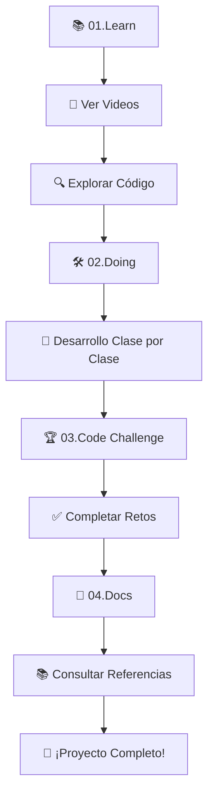

# 🚀 REACT - Aprende React desde Cero

## 🎯 Propósito

Este repositorio contiene todos los recursos, ejemplos y material de apoyo para aprender React desde cero. Aquí encontrarás componentes de ejemplo, ejercicios prácticos y código de referencia utilizado en las clases, además de estar sincronizado con la serie de videos educativos del curso.

---

## 📂 Estructura del Repositorio

```plaintext
2025-3-REACT/
├── 📚 01.Learn/          # Material de aprendizaje con videos y ejemplos de código
├── 🛠️ 02.Doing/          # Desarrollo progresivo clase por clase con objetivos específicos
├── 🏆 03.Code Challenge/  # Prácticas y retos semanales para consolidar conocimientos
└── 📖 04.Docs/           # Documentación completa, referencias y guías de trabajo
```

```plaintext
| 📁 Carpeta | 📋 Descripción | 🎯 Propósito |
|------------|----------------|---------------|
| **📚 01.Learn** | Videos educativos y código de referencia | Aprender conceptos fundamentales |
| **🛠️ 02.Doing** | Desarrollo clase por clase | Aplicar conocimientos progresivamente |
| **🏆 03.Code Challenge** | Retos y prácticas semanales | Consolidar y evaluar aprendizaje |
| **📖 04.Docs** | Documentación y referencias | Consultar guías y mejores prácticas |
```

---

## 🚀 Cómo Usar Este Repositorio

1. **Clona el repositorio** a tu máquina local:
   ```bash
   git clone https://github.com/Inadaptados/2025-3-React.git
    cd 2025-3-React
   ```
2. **Navega a la carpeta** correspondiente según tu objetivo (aprendizaje, desarrollo, retos o documentación).
3. **Sigue los videos** en la carpeta `01.Learn/` para entender los conceptos básicos.
4. **Desarrolla el proyecto** paso a paso en la carpeta `02.Doing/` siguiendo las instrucciones de cada clase.
5. **Realiza los retos** en la carpeta `03.Code Challenge/` para practicar lo aprendido.
6. **Consulta la documentación** en la carpeta `04.Docs/` para referencias y mejores prácticas.
7. **Experimenta y modifica** el código para afianzar tu comprensión y adaptarlo a tus necesidades.

---

### **📖 1. Exploración del Código**

- 🎥 **Visualiza los videos** correspondientes antes de explorar el código
- 🔍 **Lee el código** de los ejemplos mencionados en cada video
- 🧪 **Experimenta** modificando valores y propiedades
- 📝 **Toma notas** de conceptos nuevos
- ❓ **Haz preguntas** sobre lo que no entiendas

### **🛠️ 2. Práctica Activa**

- 🎯 **Replica** cada ejemplo desde cero siguiendo los videos
- 🔄 **Modifica** la funcionalidad existente
- ➕ **Agrega** nuevas características
- 🐛 **Debuggea** problemas que encuentres
- 📚 **Consulta** la documentación oficial de React y otras librerías
- 💡 **Investiga** mejores prácticas y patrones de diseño
- 🏆 **Completa** los retos en la carpeta `03.Code Challenge/`
- 📂 **Organiza** tu propio proyecto siguiendo la estructura recomendada
- 📖 **Documenta** tu aprendizaje y soluciones a problemas comunes

---

## 🚨 Problemas Comunes y Soluciones

### **❌ Error: "Module not found"**

```bash
# Solución: Verificar la ruta de importación
import Component from './components/Component'; # ✅ Correcto
import Component from './Component';           # ❌ Incorrecto si está en subcarpeta
```

### **❌ Error: "Cannot read property of undefined"**

```jsx
// Problema: No verificar si los datos existen
{
  user.name;
} // ❌ Error si user es undefined

// Solución: Usar optional chaining o verificación
{
  user?.name;
} // ✅ Correcto
{
  user && user.name;
} // ✅ También correcto
```

### **❌ Error: "Too many re-renders"**

```jsx
// Problema: useEffect sin dependencias
useEffect(() => {
  setCount(count + 1); // ❌ Bucle infinito
});

// Solución: Agregar array de dependencias
useEffect(() => {
  setCount(count + 1);
}, []); // ✅ Solo se ejecuta una vez
```

---

## 🗺️ Ruta de Aprendizaje Recomendada



---

## 🔗 Enlaces Rápidos

| 🎯 Quiero...                | 📂 Ve a...                                     | 📋 Descripción                   |
| --------------------------- | ---------------------------------------------- | -------------------------------- |
| **Empezar desde cero**      | [`01.Learn/`](./01.Learn/)                     | Videos y conceptos fundamentales |
| **Desarrollar paso a paso** | [`02.Doing/`](./02.Doing/)                     | Proyecto guiado clase por clase  |
| **Practicar retos**         | [`03.Code Challenge/`](./03.Code%20Challenge/) | Ejercicios semanales             |
| **Consultar documentación** | [`04.Docs/`](./04.Docs/)                       | Referencias y guías completas    |

---

## 🎉 ¡Felicidades por dar tus primeros pasos en React!

> **💡 Consejo:** _La práctica constante y el entendimiento de los fundamentos de diseño son la clave del éxito en el desarrollo de interfaces._ 🚀

---

<div align="center">

**📅 Última actualización:** Septiembre 2025
**🏫 Curso:** Inadaptados React 2025
**👨‍💻 Instructor:** Rodrigo Leaños Bermejo [@rodrigoBermejo]

</div>
